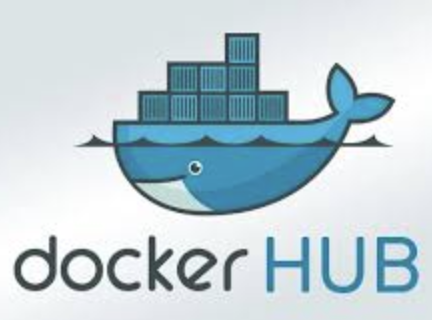

# TrucksNL/FrankenPHP
Our in-house FrankenPHP base container image with modules pre-installed to prevent rebuilding PHP modules in all of our microservices.

[ 
Docker Hub](https://hub.docker.com/r/trucksnl/frankenphp)

[ 
Github Container Registry](https://github.com/TrucksNL/frankenphp/pkgs/container/frankenphp)
